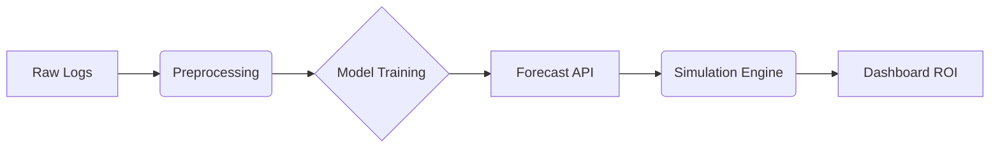

# Autoscaling-Analysis-Dataflow2026
Hệ thống dự báo tải và tự động điều chỉnh máy chủ nhằm tối ưu chi phí vận hành
---


## 1. Tóm tắt
Dự án tập trung vào **dự báo lưu lượng web** từ HTTP access logs và sử dụng kết quả dự báo để thiết kế **predictive autoscaling**, nhằm giảm chi phí hạ tầng và hạn chế dropped requests so với reactive autoscaling truyền thống.

Cách tiếp cận:
- Dự báo traffic ở các khung 1m / 5m / 15m
- So sánh Prophet, XGBoost, LSTM
- Dùng forecast làm tín hiệu điều khiển autoscaling

---

## 2. Dữ liệu
- **Nguồn**: NASA HTTP Web Server Logs (07–08/1995)
- **Trường chính**: timestamp, request, status_code, bytes
- **Tiền xử lý**:
  - Parse & chuẩn hóa thời gian
  - Loại bỏ server outage ("1995-07-28 13:25:00" - "1995-08-03 05:25:00")
  - Tổng hợp theo 1m / 5m / 15m
  - Feature engineering: lags (24h, 7d), rolling stats, calendar features

---

## 3. Cấu trúc dự án
```text
├── config/
│   └── config.yaml              # File cấu hình trung tâm (Paths, Models, Scaling params)
├── dashboard/
│   └── dashboard.py             # Mã nguồn giao diện Dashboard (Streamlit)
├── data/                        # Dữ liệu đầu vào và các file trung gian
├── notebooks/                  
│   └── EDA.ipynb                # Phân tích khám phá dữ liệu
├── results/                     # Nơi lưu kết quả dự báo và báo cáo
├── saved_models/                # Checkpoint của các mô hình đã train
├── scripts/                     # Các kịch bản thực thi 
│   ├── evaluate.py              # Đánh giá hiệu năng mô hình
│   ├── feature_eng.py           # Kỹ thuật đặc trưng
│   ├── preprocess.py            # Làm sạch và tổng hợp dữ liệu
│   ├── run_api.py               # Khởi chạy API Backend
│   ├── run_dashboard.py         # Script khởi động Dashboard
│   ├── simulate.py              # Chạy mô phỏng Autoscaling & tính ROI
│   ├── train.py                 # Pipeline huấn luyện mô hình
│   └── visualize_results.py     # Xuất biểu đồ so sánh kết quả
├── src/                         # Mã nguồn lõi 
│   ├── api/                     # API Services & Endpoints
│       ├── app.py               # FastAPI Application
│       ├── schema.py            # Pydantic Models
│       └── services.py          # Business Logic cho API
│   ├── costs.py                 # Logic tính toán chi phí & SLA
│   ├── data_preprocessing.py    # Class Parser và Processor dữ liệu
│   ├── feature_engineering.py   # Logic tạo đặc trưng (Lags, Rolling...)
│   ├── models.py                # Định nghĩa kiến trúc Prophet, XGBoost, LSTM
│   ├── scaling_policy.py        # Thuật toán Scaling
│   └── visualize.py             # Thư viện vẽ đồ thị
└── requirements.txt             # Danh sách thư viện Python
```
---

## 4. Mô hình & Kiến trúc
- **Baseline**: Naive, Seasonal Naive  
- **Mô hình**: Prophet, XGBoost, LSTM  
- **Training**:
  - Time-based split (train trước, test sau)
  - Rolling validation
- **Chống data leakage**:
  - Không shuffle
  - Chỉ dùng dữ liệu quá khứ cho lags/rolling

Pipeline:


---

## 5. Đánh giá
- **Metrics**: RMSE, MAE, MSE, MAPE
- **Nhận xét chính**:
  - 1m: nhiễu cao, khó bắt spike
  - 5m: cân bằng tốt nhất cho autoscaling
  - 15m: ổn định, phù hợp planning
- **So sánh mô hình**:
  - Prophet: mượt, bỏ lỡ spike
  - XGBoost: bám tốt biến động ngắn hạn
  - LSTM: ổn định nhất ở 15m 

---

## 6. Triển khai

```bash
# Tải về 2 file data train và test, để trong folder "data"
# Tạo môi trường
python -m venv .venv
source .venv/bin/activate        
pip install -r requirements.txt
# Huấn luyện
python scripts/preprocess.py && \
python scripts/feature_eng.py && \
python scripts/train.py && \
python scripts/evaluate.py && \
python scripts/simulate.py && \
python scripts/visualize_results.py
# Chạy API, dashboard
python scripts/run_api.py
python scripts/run_dashboard.py
```
- API endpoints:
  - `POST /forecast`
  - `POST /recommend-scaling`
- Demo UI: 

---

## 7. Kết quả & Ứng dụng

Hệ thống **predictive autoscaling** được đánh giá thông qua mô phỏng chi phí, so sánh với **reactive scaling** dưới cùng giả định hạ tầng và SLA.

### Kết quả chính

- **Khung 15 phút**: 
- Prophet / XGBoost đạt ROI khoảng **67%**, SLA khoảng **99.2%** 
- LSTM đạt ROI cao ~**90%**, SLA khoảng **99.7%** 

### Nhận xét

- Predictive autoscaling **luôn giảm chi phí** so với reactive scaling trong tất cả các kịch bản thử nghiệm.  
- Các mô hình dự báo chính xác hơn không chỉ tối ưu chi phí hạ tầng mà còn giúp **duy trì SLA ổn định (~99%)** thông qua việc giảm số lượng request bị rớt.
- Khung dự báo dài hơn kết hợp với mô hình có khả năng học phi tuyến mạnh (như LSTM) cho hiệu quả tổng thể cao hơn, nhờ giảm tần suất scaling không cần thiết và hạn chế vi phạm SLA.

### Ứng dụng

Hệ thống phù hợp cho **web services**, **API gateways** và các nền tảng **cloud autoscaling**, nơi yêu cầu **cân bằng giữa tối ưu chi phí và đảm bảo SLA**, đặc biệt trong môi trường có lưu lượng truy cập biến động theo thời gian.

## 8. Giới hạn & Hướng phát triển

- Spike bất thường chưa được mô hình hóa tường minh
- Chưa liên kết trực tiếp forecast với latency
- Hướng mở rộng:
  - Anomaly detection
  - Ensemble forecasting
  - Probabilistic forecasting
  - Transformer-based models

---

## 9. Tác giả & License

- **Tác giả**: *FunnyGuys*
- **License**: MIT
